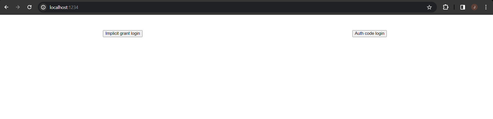
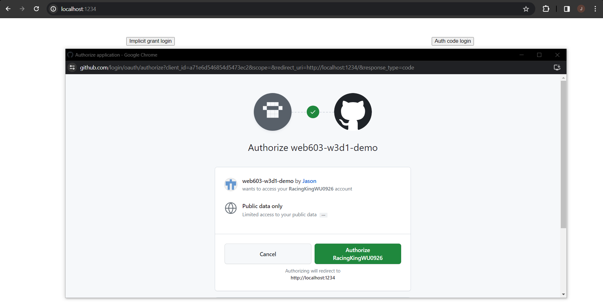
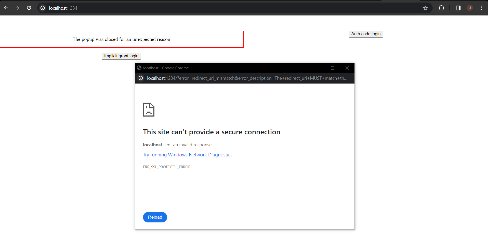

# web603-class-w3d1

## Getting Started

Follow the instruction given.

1. Install dependencies in the right place.

2. Register a new OAuth application on https://github.com/settings/applications/new.
    - For "Application Name", fill in any name.
    - For "Homepage URL", fill in `http://localhost:1234`.
    - For "Authorization callback URL", fill in `http://localhost:1234` too.

    Fill in the full URL and notice `http` instead of `https` is used, as `http://localhost:1234` is configured in our code.

    After clicking "Register application", you will get a client ID (a short string) for the application. You will grab it and paste it in `react-simple-oauth2/example/client/src/settings.sample.js` here:
    ```js
    export const clientId = 'paste it here';
    ```

3. Duplicate the file `settings.sample.js` twice but rename them to:
    - `settings-code.js`
    - `settings-implicit.js`

    as they are imported by `AuthorizationCodeExample.js` and `ImplicitGrantExample.js` respectively.

4. As you run `npm start` in `react-simple-oauth2/example/client`, this should be the outcome:

Home


Should you click on any of the two buttons, there will a pop up window asking for authorization:


If you see errors like the following, something must be wrong. Either the build is buggy, or the configuration is faulty (like typo in the Register page, or your code).

